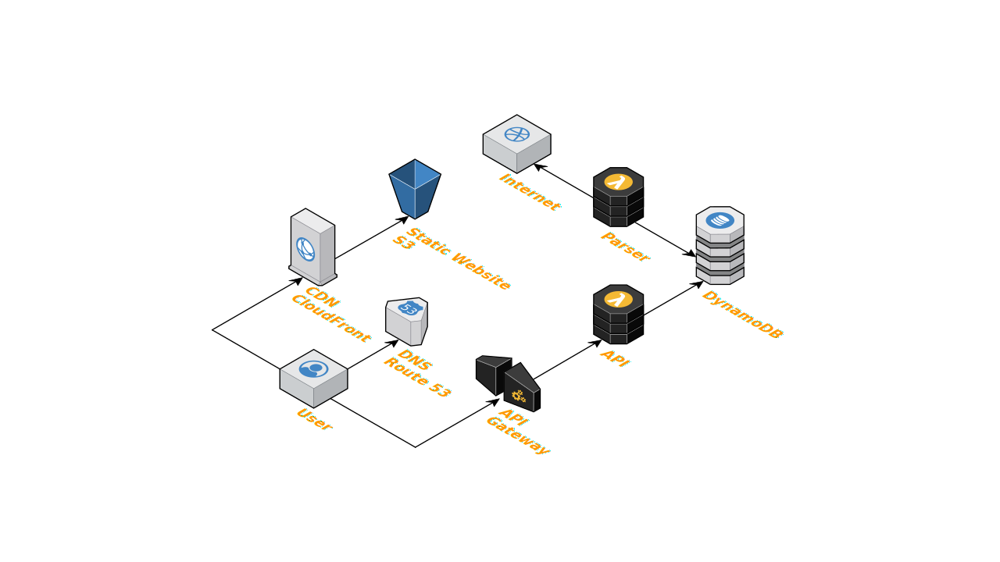

# HK News

Serves aggregated news from 13 local news publishers in Hong Kong. [https://hknews.dev](https://hknews.dev)

 

## Features

* Serves news from 13 local news publishers
* Supports video news
* Supports daily news and real-time news
* No ads

## Supported news publishers

* [Apple Daily (蘋果日報)](http://hk.apple.nextmedia.com)
* [Oriental Daily (東方日報)](http://orientaldaily.on.cc)
* [Sing Tao (星島日報)](http://std.stheadline.com)
* [Hong Kong Economic Times (經濟日報)](http://www.hket.com)
* [Sing Pao (成報)](https://www.singpao.com.hk)
* [Ming Pao (明報)](http://www.mingpao.com)
* [Headline (頭條日報)](http://hd.stheadline.com)
* [Sky Post (晴報)](http://skypost.ulifestyle.com.hk)
* [Hong Kong Economic Journal (信報)](http://www.hkej.com)
* [RTHK (香港電台)](http://news.rthk.hk)
* [South China Morning Post (南華早報)](http://www.scmp.com/frontpage/hk)
* [The Standard (英文虎報)](http://www.thestandard.com.hk)
* [Wen Wei Po (文匯報)](http://news.wenweipo.com)

## Available APIs

[OpenAPI](https://hknews.dev/api.yaml)

## Deployment

The deployment of the following resources is managed by [Terraform](https://terraform.io):

* [AWS Certificate Manager](https://aws.amazon.com/certificate-manager) for managing [hknews.dev](https://hknews.dev) domain certificate
* [AWS Lambda](https://aws.amazon.com/lambda) for serverless API services for HK News website
* [Amazon API Gateway](https://aws.amazon.com/api-gateway) for REST API management
* [Amazon CloudWatch](https://aws.amazon.com/cloudwatch) for monitoring and logging of the system
* [Amazon CloudFront](https://aws.amazon.com/cloudfront) for a fast CDN service for the static files of HK News website
* [Amazon DynamoDB](https://aws.amazon.com/dynamodb) for a managed NoSQL database service for storing news records
* [Amazon EventBridge](https://aws.amazon.com/eventbridge) for a serverless event bus that triggers news parsing functions
* [Amazon Route 53](https://aws.amazon.com/route53) for a DNS service
* [Amazon S3](https://aws.amazon.com/s3) for storing the static files of HK News website

## License
[MIT](https://github.com/ayltai/hknews/blob/master/LICENSE)
